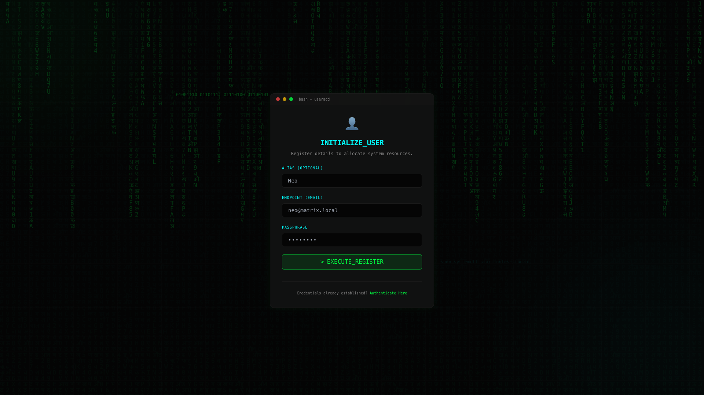
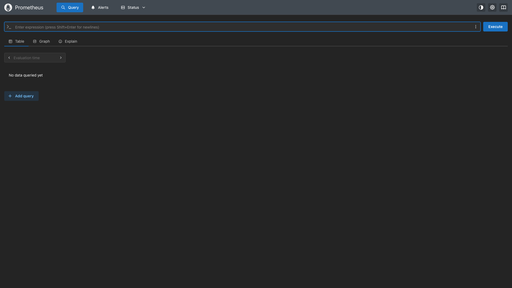
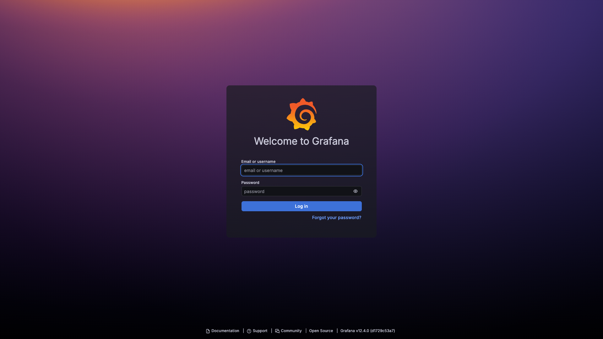
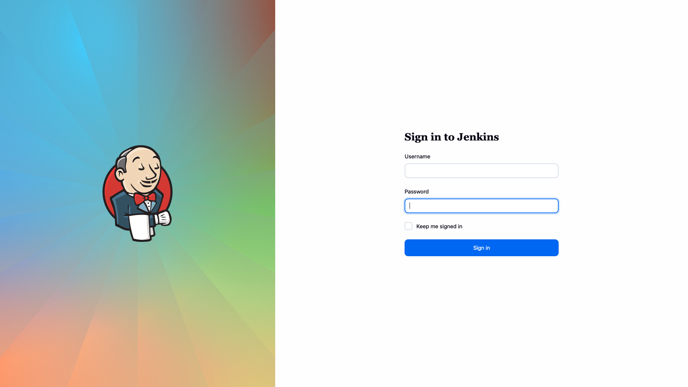

# Notes Studio

**Notes Studio** is a production-grade, full-stack application designed to showcase modern backend architecture, container orchestration, and seamless frontend integrations. Built by Pratham Vishwakarma, this project demonstrates real-world software engineering practices, prioritizing scalability, security, and maintainability. It features a unique, interactive Window OS-like portfolio interface.

---

## 📸 App Screenshots

### 1. Interactive Portfolio Login (Window OS UI)


### 2. User Registration


### 3. Main Window OS Dashboard


### 4. Notes Application


### 5. Hacker Type Application


### 6. Prometheus Service Monitoring


### 7. Grafana Visualization


### 8. Jenkins CI/CD Pipeline


---

## 🚀 Architecture Overview

Notes Studio is built using a strict **3-Tier Containerized Architecture** orchestrated by Kubernetes and Docker.

### 1. The Frontend (Next.js)
- **Framework**: Next.js (App Router) + React
- **Interface**: Custom interactive Window OS-like desktop UI featuring a responsive taskbar, dynamic clock, network speed indicator, boot animations, and integrated skills showcase.
- **Styling**: Tailwind CSS with a custom Apple-inspired glassmorphism UI.
- **Optimization**: Configured as a Next.js `standalone` build for ultra-lightweight Docker images.
- **Deployment**: Exposed via a Kubernetes LoadBalancer Service.

### 2. The Backend API (FastAPI)
- **Framework**: FastAPI (Python)
- **Database ORM**: SQLAlchemy with Pydantic for strict schema validation.
- **Security**: Stateless JWT Authentication using bcrypt password hashing.
- **Deployment**: Scaled horizontally using a Kubernetes Deployment with multiple replicas for High Availability (HA).

### 3. The Database (PostgreSQL)
- **Engine**: PostgreSQL for ACID-compliant persistent storage.
- **Security**: Credentials securely injected at runtime using Kubernetes Secrets.
- **Networking**: Isolated internal cluster networking via Kubernetes Services.

---

## 🛠️ Local Development & Deployment

This project relies on Kubernetes (`minikube` or Docker Desktop) or Docker Compose to run locally.

### Prerequisites
- Docker & Docker Compose
- Minikube or Kubernetes enabled on Docker Desktop
- `kubectl` CLI

### Running with Docker Compose
The easiest way to test the application locally:
```bash
docker-compose up -d --build
```
The app will be accessible at `http://localhost:3000`.

### Running the Kubernetes Cluster
1. **Start your local Kubernetes cluster:**
   ```bash
   minikube start
   ```

2. **Apply the Kubernetes Manifests:**
   The `k8s/` directory contains all routing, deployments, and secrets.
   ```bash
   kubectl apply -f k8s/
   ```

3. **Verify running pods:**
   Wait until all pods in the `notes-app` namespace are running:
   ```bash
   kubectl get pods -n notes-app -w
   ```

4. **Expose the LoadBalancer (Minikube users):**
   In a separate terminal, run the tunnel to expose the frontend to your local browser:
   ```bash
   minikube tunnel
   ```

5. **Access the Application:**
   Navigate to `http://localhost:3000` in your web browser.

---

## 🔒 Security & Best Practices Implemented

- **Kubernetes Secrets:** Database credentials are securely stored opaquely in Kubernetes Secrets and mounted as environment variables.
- **Stateless Authentication:** JSON Web Tokens (JWT) are used for secure, scalable authentication without the need for sticky load balancer sessions.
- **Clean Architecture & Code Hygiene:** Deeply modularized backend (`routers`, `services`, `crud`, `schemas`), separating business logic from datastore operations. Removed legacy comments and automated stubs for a spotless production repository.
- **Image Optimization:** Employs multi-stage Dockerfiles (`node:18-alpine` and `python:3.11-slim`) to minimize attack surfaces and registry pull times.

---

## 📫 Connect with the Creator

Created and maintained by **Pratham Vishwakarma**.
- **LinkedIn:** [prathamvishwakarma](https://www.linkedin.com/in/prathamvishwakarma/)
- **GitHub:** [prathamvish333](https://github.com/prathamvish333)

*Note: This repository is intended as a showcase of DevOps, Frontend UI/UX, and Backend Engineering capabilities.*
