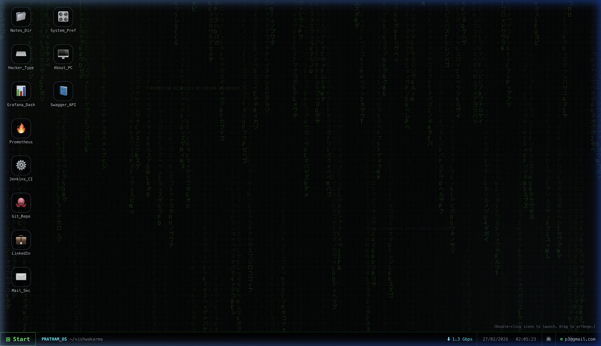
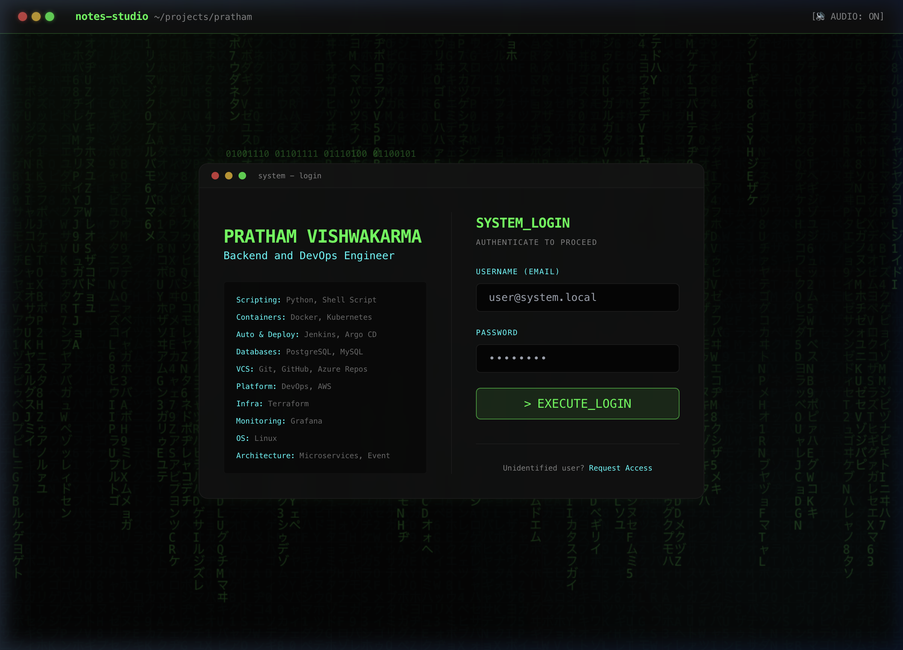
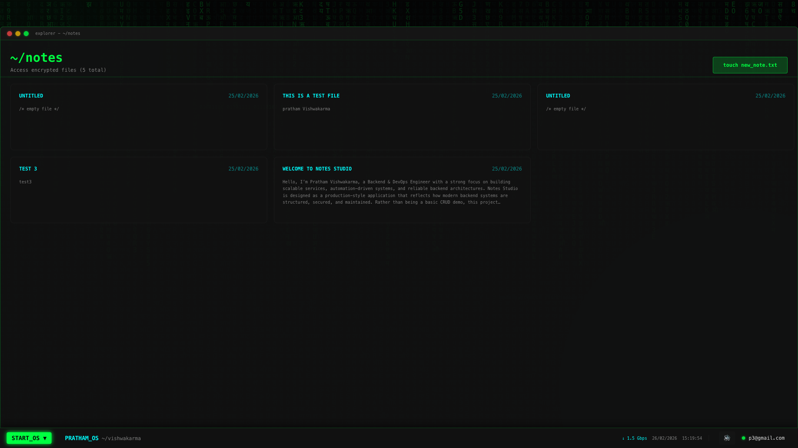
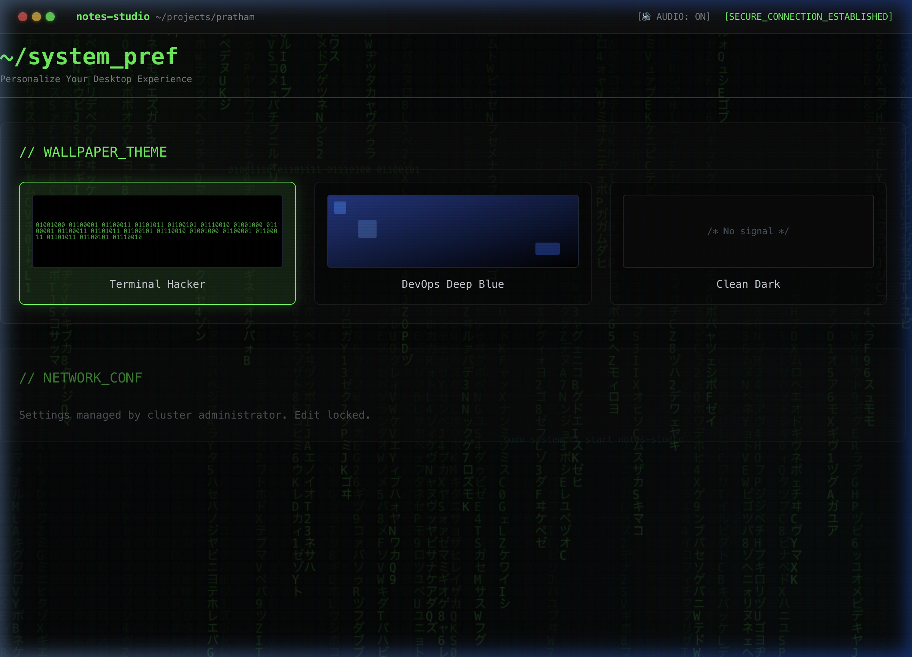

<div align="center">
  
  <h1>Notes Studio OS 🖥️</h1>
  <p><i>A Containerized, Full-Stack OS Simulation built for the Cloud-Native Era</i></p>
</div>

---

**Notes Studio OS** is a highly interactive, simulated Web Desktop environment engineered to showcase modern DevOps practices, scalable backend architectures, and robust container orchestration.

Originally conceived as a simple note-taking application, it has evolved into a complete Microservices Architecture showcasing Kubernetes deployments, persistent storage, API documentation, and a fully integrated CI/CD and Monitoring stack.

## � Interface Showcase

### 1. Interactive Portfolio Login


### 2. Main Window OS Dashboard


### 3. Core Notes Application


### 4. Hacker Terminal System Preferences


## �🚀 Key Features

*   **Interactive Web OS**: A fully draggable, window-managed React frontend simulating a Linux terminal environment.
*   **Kubernetes Native**: Zero-downtime deployment capabilities using Minikube.
*   **Persistent Storage**: Kubernetes `PersistentVolumeClaim` integration for PostgreSQL, ensuring data safety across pod restarts.
*   **Automated CI/CD**: Jenkins integrated directly into the stack for pipeline automation.
*   **Live Observability**: Real-time metrics and dashboards powered by Prometheus and Grafana.
*   **Secure API Design**: FastAPI backend equipped with Swagger UI and robust JWT authentication routing.

---

## 🛠️ Architecture & Tech Stack

This project is built from the ground up to be cloud-ready and highly available.

### Backend Infrastructure
- **FastAPI (Python)**: High-performance async API framework.
- **PostgreSQL**: Relational database for persistent user and application data.
- **SQLAlchemy & Pydantic**: Robust ORM and strict data validation layers.
- **JWT & Passlib**: Secure token-based authentication and Bcrypt password hashing.

### DevOps & Orchestration
- **Docker Compose**: Rapid local development and testing environment.
- **Kubernetes (K8s)**: Production-grade container orchestration.
  - Deployments & Services mapping.
  - Persistent Volumes (PVC) for stateful data.
- **Prometheus**: Time-series database for scraping infrastructure metrics.
- **Grafana**: Visual monitoring and alerting observability platform.
- **Jenkins**: Continuous Integration server for automated builds.

### Frontend Interface
- **Next.js & React**: Component-driven UI.
- **Framer Motion**: Fluid, real-time physics and draggable window systems.
- **Tailwind CSS**: Utility-first styling for the terminal aesthetic.

---

## 🏃‍♂️ Quick Start (Docker Compose)

The fastest way to spin up the entire cluster locally is using Docker Compose. This single command boots the Frontend, Backend, Database, and the entire Observability stack.

```bash
# Clone the repository
git clone https://github.com/prathamvish333/Notes-Studio.git
cd Notes-Studio

# Spin up the cluster in detached mode
docker-compose up -d
```

**Services Deployed via Docker Compose:**
- **Frontend OS**: [http://localhost:3002](http://localhost:3002)
- **FastAPI / Swagger UI**: [http://localhost:8000/docs](http://localhost:8000/docs)
- **Jenkins CI**: [http://localhost:8080](http://localhost:8080)
- **Prometheus**: [http://localhost:9090](http://localhost:9090)
- **Grafana**: [http://localhost:3001](http://localhost:3001) *(default: admin/admin)*

---

## ☸️ Cloud Native Setup (Kubernetes)

To run Notes Studio in a true production-simulated environment, leverage the included Kubernetes manifests.

### Prerequisites
- [Minikube](https://minikube.sigs.k8s.io/docs/start/) installed and running.
- [kubectl](https://kubernetes.io/docs/tasks/tools/) configured.
- Docker installed locally.

### 1. Build & Push Local Images to Minikube
Because Kubernetes needs access to the images, route your local Docker CLI to Minikube's daemon, then build the images:

```bash
# Point Docker to Minikube
eval $(minikube docker-env)

# Build Backend & Frontend inside the Minikube registry
docker build -t notes-backend ./backend
docker build -t notes-frontend ./frontend
```

### 2. Apply Kubernetes Manifests
Apply the manifests in order to establish namespaces, secrets, volumes, and services.

```bash
# 1. Create Domain Namespace
kubectl apply -f k8s/namespace.yaml

# 2. Inject Secrets & Credentials
kubectl apply -f k8s/secret.yaml

# 3. Provision Database & Persistent Volume Claim
kubectl apply -f k8s/db.yaml
kubectl apply -f k8s/db-service.yaml

# 4. Deploy Backend APIs
kubectl apply -f k8s/backend.yaml
kubectl apply -f k8s/backend-service.yaml

# 5. Deploy Frontend Interface
kubectl apply -f k8s/frontend.yaml
kubectl apply -f k8s/frontend-service.yaml

# 6. Deploy Observability Stack (Jenkins, Grafana, Prometheus)
kubectl apply -f k8s/monitoring.yaml
```

### 3. Expose the Cluster (Minikube Tunnel)
Because the services are deployed as `NodePort` or `LoadBalancer`, you must establish a tunnel to route traffic from your host machine into the Minikube cluster network.

```bash
# Leave this running in a separate terminal window!
minikube tunnel
```

You can now interact with the entire OS stack natively through the mapped cluster IP addresses and ports!

```bash
# Verify all pods are running successfully
kubectl get pods -n notes-app
```

---

<div align="center">
  <p>Built with ❤️ by <a href="https://github.com/prathamvish333">Pratham Vishwakarma</a></p>
  <p>
    <a href="https://www.linkedin.com/in/prathamvishwakarma">LinkedIn</a> | 
    <a href="mailto:prathamvishwakarma2000@gmail.com">Email</a>
  </p>
</div>
